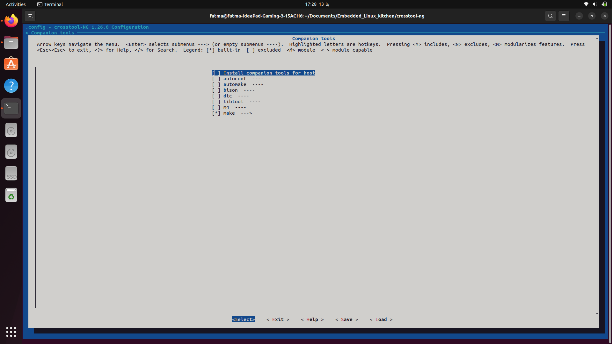

# Crosstool-NG: Build and Test Cross-Toolchains

### Crosstool-NG is a versatile and highly configurable tool for building cross-compilers. This README provides an overview of how to set up, configure, and test a toolchain using Crosstool-NG, with testing performed using QEMU.


#### Prerequisites

Before starting, ensure the following dependencies are installed on your system:

- **Build tools**: `gcc`, `g++`, `make`, `patch`, `tar`, `gzip`, `bzip2`, `xz`
- **Development tools**: `autoconf`, `automake`, `libtool`, `bison`, `flex`
- **Debug tools**: `gdb`, `strace`,
- **C libraries**: `glibc`, `Uclib`, `msul`
- **Other utilities**: `git`, `perl`, `texinfo`

Install them on Debian/Ubuntu-based systems using:

```bash
sudo apt update
sudo apt install gcc g++ make patch tar gzip bzip2 xz-utils autoconf automake libtool \
libncurses-dev zlib1g-dev gawk wget git perl texinfo bison flex
```

You will also need **QEMU** for testing. Install it with:

```bash
sudo apt install qemu-system qemu-user
```

## Installation

1. Clone the crosstool-NG repository:

   ```bash
   git clone https://github.com/crosstool-ng/crosstool-ng.git
   cd crosstool-ng
   ```


2. Build and install Crosstool-NG:

   ```bash
   ./bootstrap
   ./configure -enable-local
   make
   sudo make install
   ```

3. Verify installation:

   ```bash
   ct-ng version
   ```

## Configuration

1. Create a working directory:

   ```bash
   mkdir -p ~/crosstool-ng-workspace
   cd ~/crosstool-ng-workspace
   ```

2. Initialize Crosstool-NG:

   ```bash
   ./ct-ng list-samples
   ./ct-ng "arch"
   ./ct-ng menuconfig
   ```
     
   In the configuration menu:
   - You can also choose the architecture by Setting the **Target architecture** (e.g., `arm`, `x86_64`, `riscv64`, etc.)
   
   - Select the desired **C library** (e.g., `glibc`, `musl`, or `uclibc`).
   
   - Configure **Binutils**, **GCC**, and **kernel** versions.


   
   - Save the configuration and exit.

3. Build the toolchain:

   ```bash
   ct-ng build
   ```

   The toolchain will be built in `~/x-tools/<target-triplet>`.

## Testing with QEMU

1. Install QEMU for the target architecture (e.g., ARM):

   ```bash
   sudo apt install qemu-user-static
   ```

2. Create a simple test program:

   ```c
   #include <stdio.h>

   int main() {
       printf("Hello, Crosstool-NG!\n");
       return 0;
   }
   ```

   Save this file as `test.c`.

3. Compile the test program with the cross-compiler:

   ```bash
   ~/x-tools/<target-triplet>/bin/<target-triplet>-gcc test.c -o test
   ```

4. Run the compiled binary with QEMU:
   The sysroot is a directory that acts as a pseudo-filesystem that allows dynamic linking with libraries even if the target does not have an operating system , it will not run with out it 
   ```bash
   qemu-<target> -L /home/fatma/x-tools/arm-Fatma-linux-gnueabihf/arm-Fatma-linux-gnueabihf/sysroot test

   ```

   Replace `<target>` with the appropriate QEMU target (e.g., `arm`, `aarch64`, `riscv64`, etc.). The output should be:

   ```
   Hello, Crosstool-NG!
   ```

## Troubleshooting

- If the build fails, check the logs in the `.build` directory for detailed error messages.
- Ensure all dependencies are installed and compatible with the versions of Crosstool-NG and QEMU.

## Documentation

Refer to the official documentation for more advanced configurations:
- [Crosstool-NG Documentation](https://crosstool-ng.github.io/)

---


